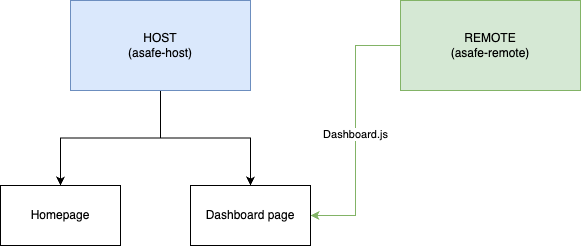

# Asafe MFE - host

This is a host MFE created with `NextJS` that is capable of consuming remote MFE components. It is a web application to display crypto data to authenticated users

## Diagram



## Project structure

- Built using NextJS v13 pages router (unfortunately there is no support for module federation on app router yet and v14 support is still flaky)
- Uses `TypeScript` and `TailwindCSS`
- Components
  - `LoginInfoHeader` - Displays session info for a logged user
  - `Navbar` - Allows navigation between pages
- Pages
  - `index` - Homepage. Displays info about the site
  - `dashboard`
    - Only for authorized users. Protected using `NextAuth`
    - Dynamically imports `Dashboard` component, which is a federated module from [asafe-remote](https://github.com/mfimia/asafe-remote)
    - Contains a list of tokens fetched from CoinGecko api
    - Leverages SSR to enhance SEO by rendering the first coins of the list statically on build time using NextJS's [getStaticProps](https://nextjs.org/docs/pages/building-your-application/data-fetching/get-static-props). Props revalidated once per day
- API routes
  - `auth` - Special route to enable `NextAuth` functionality. Currently Google and GitHub configured as OAuth providers
  - `coins` - BFF layer to fetch data from CoinGecko api. It retrieves a large amount of coin data
    - Enabled cache logic. Invalidation every 5 mins
- E2E tests
  - Using cypress as testing framework
  - Testing authorization flow on navigation component

## Amazing, right? Here is how to use it:

### For development:

1. Ensure you have node and npm installed on your machine:

- [Node.js](https://nodejs.org/)
- npm

2. Clone the repository and install dependencies:

```sh
git clone https://github.com/mfimia/asafe-host.git
cd asafe-host
npm install
```

3. Set up environment variables

- Copy all contents of `.env.example` file and paste them into a new `.env` file that won't be tracked by version control
- Make sure to populate all the credentials for OAuth providers, CoinGecko api, and generate a new `NEXTAUTH_SECRET` of your own. Below are some guides to help you out:
  - [Set up Google OAuth credentials](https://next-auth.js.org/providers/google)
  - [Set up GitHub OAuth credentials](https://next-auth.js.org/providers/github)
  - [CoinGecko api docs](https://docs.coingecko.com/v3.0.1/reference/setting-up-your-api-key)
  - Use `openssl rand -base64 32` on your terminal to generate a good `NEXTAUTH_SECRET`

4. Spin up dev server

```sh
# To run the application in development mode:
npm run dev
# This will spin up the application on http://localhost:3000
```

> :warning: Please make sure you are also running another terminal with [asafe-remote](https://github.com/mfimia/asafe-remote) on dev mode. It will consume port 3001. This will provide the code to generate the Dashboard in your dashboard page. Follow the instructions on the project's README to get started

5. Running tests

- Copy the contents of `.env.cypress` into a new `cypress.env.json` file that won't be tracked by version control
  - To correctly populate `VALID_TEST_COOKIE`, make sure to have logged in first manually, then go into the browser DevTools and grab the value of `next-auth.session-token`
- To start cypress, run this command:

```sh
npm run cypress:open
```

6. Happy coding!

### Deployment

The easiest way to deploy a Next.js app is to use the [Vercel Platform](https://vercel.com/new?utm_medium=default-template&filter=next.js&utm_source=create-next-app&utm_campaign=create-next-app-readme) from the creators of Next.js.

Check out the documentation [Next.js deployment documentation](https://nextjs.org/docs/deployment) for more details. It should be just a few clicks

> :warning: Please remember to update env variables with your production configuration. You will need the deployed URL of `asafe-remote` in this environment, so please make sure to have that code also deployed

Made with ❤️ by [MF](https://github.com/mfimia)
